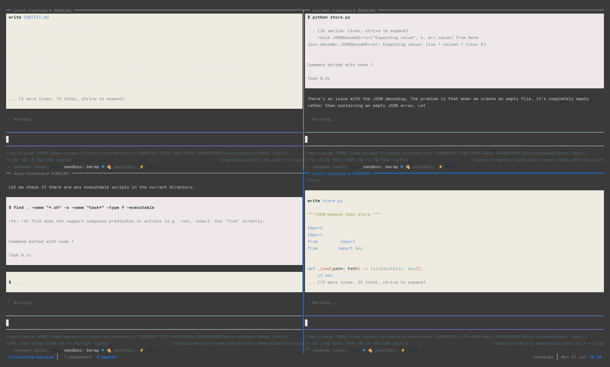
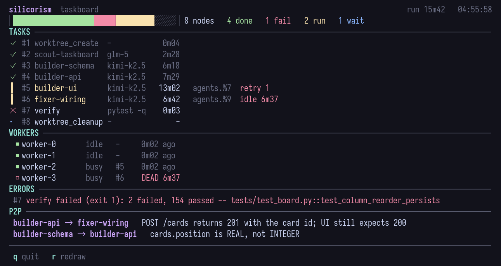

# Silicorism

[](https://github.com/naveen-og/silicorism/actions/workflows/ci.yml)

Silicon + Tribalism: a multi-agent task orchestrator that runs OSS coding models as
live agents, side by side, in one tmux window. SQLite in WAL mode plus a pool of
worker processes. Pure Python stdlib — no dependencies.

The premise: a strong reasoning model is expensive per token and a strong *coding*
model is not. So the expensive one plans and never executes, and a trio of OSS
models does the work in parallel, each in its own pane where you can watch it.

- [Quickstart](#quickstart) · [What you see](#what-you-see) ·
  [Reliability](#reliability-what-stops-a-run-from-lying-to-you) ·
  [MCP server](#mcp-server-claude-code) · [Concurrency](#concurrency-model) ·
  [Layout](#layout)

## Quickstart

```bash
pip install -e .          # or: pipx install .  → global `silicorism` command
claude mcp add silicorism --scope user -- silicorism mcp
```

Then, from Claude Code in any repo: *"orchestrate this with silicorism"*. Claude
plans, submits a DAG, and workers start themselves. Watch it with
`tmux attach -t silicorism-session`.

Without Claude in the loop:

```bash
silicorism init                                        # DB auto-resolves per repo
silicorism add    --type shell --payload "echo hi" --priority 5
silicorism run    --workers 4 --drain                  # drop --drain to run forever
silicorism dashboard                                   # the live view below
silicorism submit-feature --name auth --prompt "add JWT auth"   # 6-node DAG
silicorism logs   --task 7 --follow                    # one task's log
silicorism status --watch                              # counts + heartbeats
silicorism reset                                       # requeue tasks stuck 'processing'
silicorism gc --failed                                 # reclaim worktrees
```

`--db` is optional: it defaults to `<repo>/.git/silicorism.db` inside a git repo,
else `~/.config/silicorism/repos/<slug>/silicorism.db`. So `silicorism` works from
any repo with no flags.

## What you see



Four `pi` agents on three different models, tiled in the `agents` window: each pane
is the real interactive TUI, not a log tail. The border carries the agent id and its
state (`RUNNING` / `DONE` / `FAILED`). Panes are capped at four per window so a TUI
stays readable — the fifth agent opens `agents-2`.



The `dashboard` window answers "is this run healthy" at a glance: a stacked
done/failed/running/pending bar and the run's wall clock, then every node in
execution order with its model (or, for a gate node, its test command), elapsed
time, pane, and `idle Nm` once a running node's files have stopped changing.
Below it: which workers are still beating (`DEAD` when one is not), the actual
failure line rather than a pointer to the logs, and the P2P feed.

Once a node reports usage, a third header line shows what the run burnt and
what it avoided — `12.4k in / 3.1k out   spent $0.00   saved $0.14`.

Running nodes spin, so a frozen monitor is never mistaken for a quiet queue. A
long run folds its finished nodes into `N done` instead of pushing the live ones
off screen. `q` quits; glyphs fall back to ASCII off a UTF-8 locale or under
`SILICORISM_ASCII=1`.

## Reliability: what stops a run from lying to you

An orchestrator is only useful if its verdict is trustworthy. Every item here
exists because the opposite happened in a real run.

| Guarantee | Mechanism |
|---|---|
| A node cannot declare its own success | `test_command` on an agent node is run by the **worker** after the agent exits, on both execution paths, and non-zero fails the node. A pane's exit code only says the process ended: `autoexit.ts` exits 0 for any run that settled, so an agent that did nothing still "succeeds". |
| Nor can the pipeline | The chain ends in a `harness: "verify"` node holding the real test command, so no agent's claim can close the run. |
| Nor can green tests | A node may declare `requires` — files that must exist, symbols that must appear in them, placeholders (`TODO`, `unimplemented`) that must not, minimum line counts — and the **worker** checks them literally after the agent exits, before the tests. Tests only fail on what they cover, so every defect that survived a green gate here was an absence: a list capped at 3 where the spec said 6, a function imported by the tests and never called, a feature stubbed as a no-op with its test dropped. No suite could have caught any of them. |
| A new test is a real test | `expect_fail: true` on a `verify` node requires a **non-zero** exit. Put one between the node that writes the test and the node that implements it, and a test that passes against unwritten code fails the run where it was written instead of certifying it four nodes later. |
| A worktree is created in the repo it belongs to | `worktree_create` runs git in the DAG's `cwd`, and `build_dag` rejects a named DAG whose `cwd` is not inside a repository. `git worktree add` used to run wherever the worker was started: for a worker launched from a home directory that is `fatal: not a git repository`, and the failed node then blocked every dependent forever. The base branch defaults to the repo's own current branch rather than a guessed `main`. |
| Discipline is the floor, not an opt-in | Every agent node gets `coding-excellence` unless it names its own `skills` (`[]` means none). And an injected skill now carries its directory: `coding-excellence`'s SKILL.md opens with "read CORE.md now", and a node launched with discovery off cannot resolve a bare filename — the injection was a pointer to nothing. |
| A wedged node is visible | The worker stamps `last_progress_at` from the newest mtime under the task's cwd, so a busy heartbeat is no longer the only signal. `get_status()` returns a `stalled` list; the dashboard shows `idle Nm`. |
| A wedged node ends | `stall_timeout_s` (default 600) fails a node whose files stop changing. Without it a node that hung at minute 2 held its worker until the 3600s ceiling. `timeout_s` overrides that ceiling. |
| A killed agent takes its children with it | The pane's launch script traps `HUP`/`INT`/`TERM` and signals its whole process group, so a timed-out node does not leave `gopls` and `pyright-langserver` resident. |
| A timeout never looks like a verdict | `silicorism_wait` returns `timed_out` and `elapsed_s`; `settled: false` with `timed_out: true` means nothing was decided. |
| A dead pipeline is recoverable | `silicorism_gc(stuck=true)` force-fails `processing` rows that are stale by heartbeat *or* by progress; `silicorism_cancel_task` ends one node and kills its pane. Previously the only workaround was abandoning the database. |
| An artifact belongs to its own run | Pane logs and artifacts are namespaced per DB and truncated before the pane opens. Both were keyed on the task id alone in one shared directory, and every DB numbers from 1 — so a node with no artifact of its own reported an unrelated run's pane text as output, and that output is handed to the next node as context. |
| Retries never silently bill Claude | The escalation ladder is OSS-only: `kimi-k2.5` → `glm-5`, then the failure goes to the orchestrator. |
| A model swap is never mistaken for misrouting | Escalation records `model_requested` instead of overwriting `model` in place, and the dashboard marks the running model `^glm-5`. Without it, a glm-5 pane for a node the plan sent to kimi-k2.5 is indistinguishable from a routing bug. |
| A node runs on the plan, not on the machine | pi nodes launch with `-nc -ne -ns -np`, so they do not discover the operator's global `CLAUDE.md`, skills, prompt templates or installed extensions. Measured on one five-word prompt: **13,999 input tokens with discovery on, 1,837 without** — paid every turn of every node, and different on every machine. The repo's own `AGENTS.md`/`CLAUDE.md` is added back deliberately by path, so a node keeps its project's conventions and none of the operator's. |
| A `claude` node is isolated too | The same contract in that CLI's flags: `--setting-sources project` drops the operator's global settings, skills and hooks; `--strict-mcp-config` with no `--mcp-config` leaves the node zero MCP servers (the `-ne` case); `--no-session-persistence` keeps a one-shot node out of the resume history. Narrower than pi's, not equal: no flag suppresses the user-level `CLAUDE.md`. |
| The cost claim is measured, not asserted | `autoexit.ts` sums each response's `usage` (deduped by `responseId`, since `agent_end` re-delivers the whole conversation) and the worker banks it per task — on failed runs too, because those tokens were paid for. The dashboard and `silicorism_get_status` show tokens, spend, and **saved**: the same tokens priced at the planner's own rate, which is the only number that says whether the architecture pays for itself. Gateway spend reads `$0.00` because bedrock-mantle publishes no price metadata and the opencode models are free tier — that is a measurement, not an estimate. |
| An edge carries a summary, not a transcript | A node ends with a `--- HANDOFF ---` block (files, added, decisions, open) and only that block is put in front of its dependents; a node that forgets the format falls back to a bounded tail rather than its whole output. One live run spent 10,072 input tokens on a node whose job was to append a single function, nearly all of it its parent's prose. |
| Two nodes cannot race for one file | A node may declare `writes: [...]`. `build_dag` rejects a DAG where two nodes claim the same file and neither is an ancestor of the other, and tells the node which files are its own. Two builders once appended to one `calc.py` in one worktree simultaneously and both edits survived on luck. Undeclared nodes are not policed — the claim is a declaration, not a discovery. |
| Mail arrives without being asked for | Messages waiting when a node launches are drained into its prompt instead of sitting until someone polls. The channel was pull-only and nothing downstream ever stopped mid-run to look. |
| A worker cannot start its own runs | `extensions/silicorism.ts` registers `silicorism_plan_and_submit` and `install-extension` puts it in `~/.pi/extensions`, so every execution node used to discover the orchestrator's own tools. `-ne` removes them; the explicit `-e autoexit.ts` still loads. |
| The shipped package is what is here | A test asserts `py-modules` covers every top-level module and every console-script target is callable, and CI installs the package and drives it from outside the repo. `silicorism dashboard` shipped unable to start because the suite only ever ran from the repo, where CWD is on `sys.path`. |

## Splice: gated edits

If a [splice](https://github.com/) checkout is present, every pi node gets
`read_scope_map` and `splice_edit` loaded by explicit `-e` path — the same way
`autoexit.ts` arrives, so `-ne` stays on and the node still discovers nothing on
its own. Splice edits by AST anchor (`#Name@hash`, the hash being a staleness
check) through a shadow VFS behind an **LSP delta gate**: an edit that
introduces a new diagnostic is rejected instead of committed. Splice's own
`system-prompt-overlay.md` is appended alongside the repo's context file,
because a weak model ignores a tool it was never told to prefer.

Preferred, not enforced: pi's `write`/`edit` stay available, so a node blocked
by a splice rejection can still finish.

Found via `SILICORISM_SPLICE`, else `~/.pi/agent/extensions/splice`, else
`~/Projects/splice`. Setting the variable to anything that is not a checkout
(`SILICORISM_SPLICE=off`) turns it off.

**Reading a file through splice is far cheaper than reading the file.**
`read_scope_map` returns anchors and the file's indentation, not bodies; a body
comes back only for anchors named in `include`. Measured against the raw source:

| file | raw bytes | scope map | ratio |
|---|---|---|---|
| `src/targeting.ts` | 3,211 | 496 | 6.4× |
| `src/shadow-vfs.ts` | 6,293 | 1,956 | 3.2× |
| `src/cst-indexer.ts` | 17,225 | 1,347 | 12.8× |
| `src/smart-patch-engine.ts` | 23,388 | 797 | 29.3× |

**But the per-turn overhead is fixed and it dominates on small files.** The
overlay (2,653 bytes) and two tool schemas (2,077 bytes) are re-sent every turn,
about 1,180 tokens, whatever the file is. On the same six-node DAG over a
three-function `calc.py` — where the scope map saves almost nothing because the
file is tiny:

| | splice off | splice on |
|---|---|---|
| **total input** | **23,281** | **29,778** |

Break-even is roughly a 150-line file. Below that splice costs more than it
saves and only the gate justifies it; above it, splice is the cheapest way to
look at code in the toolbox. `calc.py` is the wrong benchmark for it — it is
here to prove the wiring, not the economics.

For the planner side, register the MCP server with Claude Code:

```bash
claude mcp add splice -- node ~/Projects/splice/src/mcp/main.ts
```

Node 26 strips the types, so there is no build step; verified by answering a
`tools/list` with `read_scope_map` and `splice_edit`.

## Native agents, harnesses & skills

`pi`/`claude` tasks run live in a tmux pane under `SILICORISM_NATIVE=1`. The agent
owns the pane's tty — that is what makes the TUI render — and tmux mirrors the pane
into `~/.config/silicorism/logs/<db-slug>-task-<id>.log`, whose tail becomes the
task's `output_artifact` for downstream DAG steps (or the clean text
`autoexit.ts` wrote, when there is one).

A DAG node picks its harness and model via the payload: `{"model": "kimi-k2.5"}`
routes `pi`, an Anthropic model id routes `claude`. Requested skills
(`{"skills": ["coding-excellence"]}`) are resolved from `~/.claude/skills`,
`~/.pi/skills`, and local `./.claude/skills`, `./.pi/skills` (local wins) and
injected into the agent prompt. That injection is the *only* way a skill reaches
a node: pi's own discovery is off, so a node's context is exactly what the plan
bound plus the repo's own `AGENTS.md`. See the isolation rows above.

## MCP server (Claude Code)

```bash
claude mcp add silicorism --scope user -- silicorism mcp
```

Eight tools: `silicorism_list_skills`, `silicorism_plan_and_submit`,
`silicorism_wait`, `silicorism_get_status`, `silicorism_start_workers`,
`silicorism_cancel_task`, `silicorism_gc`, `silicorism_verify_and_continue`.

On connect the server sends an `instructions` protocol the orchestrator follows:
**discover skills → clarify (zero assumptions) → master plan → submit → verify &
loop**. `silicorism_list_skills` inventories skills (name/harness/scope/description)
so they can be bound to DAG nodes during planning.

**Orchestrator loop.** `silicorism_plan_and_submit` submits a plan **and
auto-starts native-pane workers** in one call. Pass `prompt` plus a
`complexity` tier, or `nodes` for a custom DAG you design — each node sets its own
`id`, `prompt`, `depends_on`, `harness` (`pi`/`claude`), `model`, `thinking`
(`high`…), `skills`, and optionally `test_command`, `stall_timeout_s`, `timeout_s`.
`silicorism_get_status` returns a `satisfied` verdict plus each failed task's
artifact, last error, and the `stalled` list; `silicorism_verify_and_continue`
lets the orchestrator resubmit a corrective DAG and re-run until satisfied.

Default per-role models are the **bedrock-mantle OSS pair** (`thinking: high`):
scout `zai.glm-5`, builder and fixer `moonshotai.kimi-k2.5` — all overridable per
node. Friendly names (`kimi-k2.5`, `glm-5`, `deepseek-v4-flash`,
`qwen3-coder-480b`) resolve to full ids.

The roster is closed. `handlers.ALLOWED_MODELS` is the whole set a node may run
on, with the thinking levels each is allowed at — `kimi-k2.5` and `glm-5` at
`medium` or `high`, `deepseek-v4-flash` only at `max`. Anything else, including
a full id typed by hand, is rejected by `build_dag` at submission instead of
dying at CLI startup in a pane. The rest of the opencode free tier was removed
on 2026-07-30: their output was not worth the orchestration around it. Nothing
routes onto `qwen3-coder-480b`, and it is not on the roster.

**Complexity tiers.** `silicorism_plan_and_submit` takes
`complexity: simple | standard | complex`, so a small program does not get a
six-node pipeline built for a refactor:

| Tier | Shape | When |
|------|-------|------|
| `simple` | one agent on `kimi-k2.5`, in `cwd`, no worktree; a `verify` node only if you supply a test command | a self-contained program |
| `standard` | worktree → scout → builder → fixer → verify → cleanup | a change to an existing codebase |
| `complex` | two builders in separate worktrees, fanned out from one scout, rejoined by `worktree_integrate` plus an integrator agent | work that splits into disjoint slices |

An unrecognised tier degrades to `standard`; a typo in a planning hint should not
fail a submit.

**Waiting, not polling.** `silicorism_wait` blocks until the queue settles and
returns the verdict once. Polling status in a loop costs a full orchestrator turn
per poll to learn "still running" — this is the difference between planning being
cheap and watching being expensive. It also settles early on a *fresh* failure, and
does not count nodes stranded behind a failed dependency as still active.

**The agents grid.** `pi` tasks run the full interactive TUI in a tiled pane
(`extensions/autoexit.ts` exits pi when the agent settles, writes the clean final
answer to `$SILICORISM_ARTIFACT`, and a sentinel file captures the exit code). Panes
are addressed by tmux pane id, not window index, so a closed pane never shifts
another agent's address. Attach with `tmux attach -t silicorism-session`.

**Verify gate + merge.** The standard pipeline is six nodes: a deterministic `verify`
node re-runs the test command after the fixer — cleanup is unreachable unless it
exits 0. `build_pipeline(..., merge=True)` adds a `worktree_merge` node that
commits worktree changes and `--no-ff` merges the branch into base; conflicts
fail the task and quarantine the worktree.

## Concurrency model

- Every state write goes through `db.immediate()` = `BEGIN IMMEDIATE` + exponential
  backoff on `SQLITE_BUSY`. `busy_timeout=5000` absorbs normal contention; backoff
  covers the tail.
- `claim_task` selects the top-priority `pending` row and flips it to `processing`
  in one transaction — a task can never be claimed twice.
- Workers requeue their in-flight task on `SIGINT`/`SIGTERM`; nothing is orphaned.
- Idle loops run `PRAGMA wal_checkpoint(PASSIVE)` for non-blocking WAL upkeep.
- A draining worker exits only when nothing is pending *and* nothing is in flight —
  an empty poll means "nothing claimable yet", and exiting on it would leave one
  worker to run a fan-out serially.
- Pane placement is serialised with a lock file: four workers racing to open the
  grid would otherwise each create their own `agents` window.
- `silicorism_wait` requeues tasks whose worker stopped heartbeating, so a pane
  closed mid-run cannot strand everything behind it.
- Cleanup commits the worktree before removing it and deletes the branch only if
  it merged, so an unmerged run's work survives on its branch.

## Layout

| File | Role |
|------|------|
| `db.py` | WAL layer: schema, PRAGMAs, atomic `BEGIN IMMEDIATE` writes with backoff |
| `handlers.py` | task-type handlers (`shell`, `sleep`, `echo`, `fail`, `pi`, `claude`, `verify`, worktree, `fixer_loop`) |
| `worker.py` | one worker process: claim → run → gate → log → mark, clean signal shutdown |
| `cli.py` | init / add / run / status / reset / submit-feature / supervise / dashboard / logs / gc / msg / mcp / verify / install-extension |
| `silicorism_tools.py` | harness-agnostic bridge: pipeline build, gc, status, cancel, worker spawn |
| `tmux_orchestrator.py` | the agents grid: tiled panes, pane-id addressing, per-task logs, process-group teardown |
| `dashboard.py` | curses dashboard: progress bar, DAG, worker liveness, errors, P2P |
| `skills.py` | resolve + inject skill prompts from `.claude`/`.pi` (global + local) |
| `silicorism_mcp.py` | pure-stdlib JSON-RPC stdio MCP server for Claude Code |
| `extensions/silicorism.ts` | native Pi extension (typechecks clean vs shipped `pi` types) |
| `.claude/agents/` | `planner`, `executor`, `reviewer` subagent defs (`model: sonnet-5`) |
| `tests/` | concurrent writes, no double-claim, end-to-end drain, MCP, gate + stall, dashboard |

## Test

```bash
python -m pytest tests/ -q         # the whole suite; CI runs it on 3.10 and 3.14
python tests/test_db.py            # 8 procs × writes, no busy, no double-claim
python tests/test_integration.py   # 40-task pool drains, correct terminal states
```

The suite mocks the agent away, which proves the plumbing and nothing about
whether a free model can finish a node. One test runs the real thing — six
nodes, four OSS models, live tmux panes — and is opt-in so CI stays offline:

```bash
SILICORISM_INVIVO=1 python -m pytest tests/test_invivo_dag.py -s
```

`handlers.py`, `silicorism_tools.py`, `tmux_orchestrator.py`, `skills.py` and
`silicorism_mcp.py` also self-check under `python <module>.py` — the tmux command
strings, the model ladder and the tier shapes are asserted without a server.

## Subagents

`.claude/agents/*.md` define delegation roles for Claude Code: **planner** decomposes
a goal and enqueues tasks, **executor** runs one atomic task, **reviewer** audits
read-only. The Python pool executes the queue; the agents decide what goes in it.
